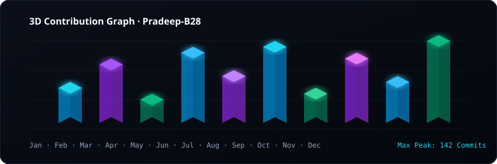
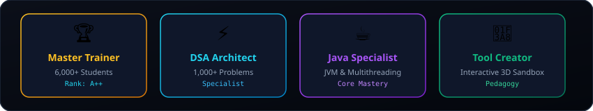
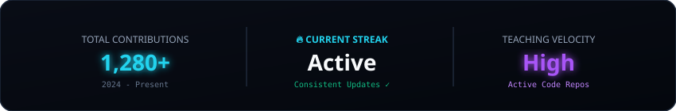
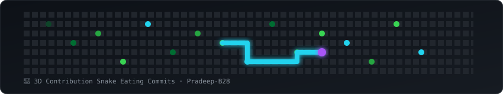

  <!-- Dynamic 3D Header Banner -->
  

  

    
    
    
    
    
    
    
  

---

### 🌐 [Launch My Interactive 3D WebGL Portfolio & Sandbox](https://pradeep-b28.github.io/Pradeep-B28/)
> *Featuring live 3D sorting simulations, binary search tree renders, 3D skyline constellations, glassmorphism UI, and interactive curriculum modules.*

---

## ⚡ Building Confident Problem Solvers & Software Engineers

I am a **Java and Data Structures & Algorithms Trainer** and **Full-Stack Engineer** dedicated to bridging the gap between basic syntax and high-level interview problem-solving. My training methodology turns abstract algorithms into repeatable visual patterns students can naturally apply in interviews and real-world software architecture.

- 🎓 **Mentored 6,000+ Students** through structured Java, Data Structures, Algorithms, and Full-Stack Engineering bootcamps.
- 💡 **Specialization**: Core Java, JVM Internals, Collections Framework, Multithreading, DSA, Dynamic Programming, and System Architecture.
- 🚀 **Open Source & Enterprise Projects**: Creator of **Schema Sentinel** (Pre-migration PostgreSQL Risk Engine & GitHub Action), **Ledger** (Enterprise AI Expense Suite), **GIT---viz** (3D Profile Galaxy), **Rel_Notes** (AI Release Generator), **Devstarter** (Devcontainers), and interactive algorithm visualizers.

---

## 🔮 3D Contribution Landscape

  

---

## 🛠️ Tech Stack & Tooling

  

 

| Java Foundations | Data Structures & Algorithms | Enterprise Full-Stack & Mobile |
| :--- | :--- | :--- |
| **Core Java** · OOP Principles · Collections | **Arrays & Strings** · Two Pointers · Sliding Window | **MERN Stack** · React 18, Node.js, Express, MongoDB |
| **JVM Internals** · Memory Management & GC | **Trees & Graphs** · BFS, DFS, Dijkstra, Tarjan | **Mobile & PWA** · Capacitor 6, Android Studio, Service Workers |
| **Multithreading** · Concurrency & Locks | **Dynamic Programming** · 1D & 2D Memoization | **AI & WebGL** · Three.js, Groq AI, Shaders & Devcontainers |

---

## 📌 Featured Flagship Projects & Open Source

<table>
  <tr>
    <td width="50%" valign="top">
      <h3>🔍 <a href="https://github.com/Pradeep-B28/Schema-Sentinel">Schema Sentinel — PostgreSQL Risk Analyzer</a></h3>
      
Production-aware pre-migration risk analysis engine for PostgreSQL. AST SQL parser, safe read-only database profiler, 4-axis risk scoring matrix (0-10), and automated GitHub Action PR gatekeeper.

      
<a href="https://github.com/Pradeep-B28/Schema-Sentinel"><b>📦 View Repository & Source Code</b></a>

    </td>
    <td width="50%" valign="top">
      <h3>💸 <a href="https://github.com/Pradeep-B28/ledger-expense-tracker">Ledger — Enterprise AI Expense Tracker</a></h3>
      
Market-ready MERN + PWA + Capacitor Android expense tracker with 0ms Optimistic UI engine, adjacent 3-column live dashboard, AI Chatbot Assistant, multi-currency formatting, 5 themes, and bank cloud sync.

      
<a href="https://github.com/Pradeep-B28/ledger-expense-tracker"><b>📦 View Repository & Source Code</b></a>

    </td>
  </tr>
  <tr>
    <td width="50%" valign="top">
      <h3>🎨 <a href="https://github.com/Pradeep-B28/GIT---viz">GIT---viz (3D Profile & Galaxy Visualizer)</a></h3>
      
Turn any GitHub profile into a 3D city skyline, orbital repo galaxy, tech archipelago, or developer duel with WASD drone flight, bloom shaders, and Web Audio melodic synth.

      
<a href="https://pradeep-b28.github.io/GIT---viz/"><b>🚀 Launch Live 3D App</b></a>

    </td>
    <td width="50%" valign="top">
      <h3>📝 <a href="https://github.com/Pradeep-B28/Rel_Notes">Rel_Notes (AI Release Notes Generator)</a></h3>
      
AI-powered release notes generator built with TypeScript and Groq API. Automatically transforms raw Git commit history into clean, formatted release notes in seconds.

      
<a href="https://github.com/Pradeep-B28/Rel_Notes"><b>📦 Explore Source Code</b></a>

    </td>
  </tr>
  <tr>
    <td width="50%" valign="top">
      <h3>🐳 <a href="https://github.com/Pradeep-B28/Devstarter">Devstarter (Devcontainer Templates)</a></h3>
      
Zero-configuration devcontainer templates for Python, Node, Go, Rust, C++, and Java. Open any repository in VS Code with a single click—no setup required.

      
<a href="https://github.com/Pradeep-B28/Devstarter"><b>📦 Explore Templates</b></a>

    </td>
    <td width="50%" valign="top">
      <h3>🗺️ <a href="https://github.com/Pradeep-B28/JAVA-DSA-Roadmap">Java + DSA Master Roadmap</a></h3>
      
A comprehensive, beginner-to-advanced curriculum mapping out Core Java, Object-Oriented Design, and interview-ready Data Structures & Algorithms.

      
<a href="https://github.com/Pradeep-B28/JAVA-DSA-Roadmap"><b>📖 View Roadmap</b></a>

    </td>
  </tr>
</table>

---

## 🏆 Developer Trophies & Milestones

  

---

## 📊 Analytics & Velocity Stats

  
    
  

---

## 🐍 3D Contribution Grid Snake

  

---

  <i>"Making complex algorithms and full-stack software simple, one student at a time."</i>

